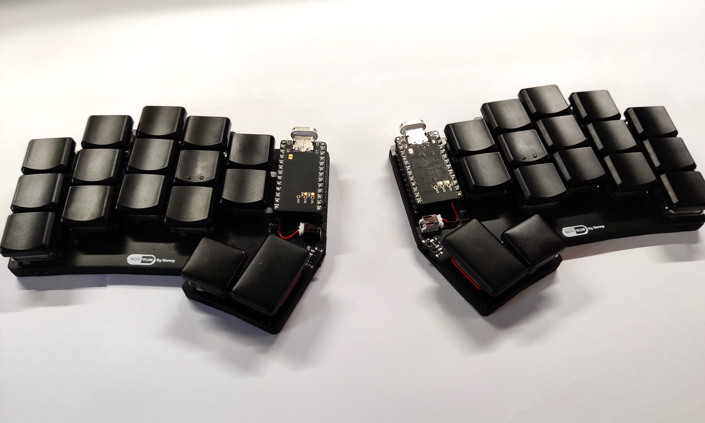
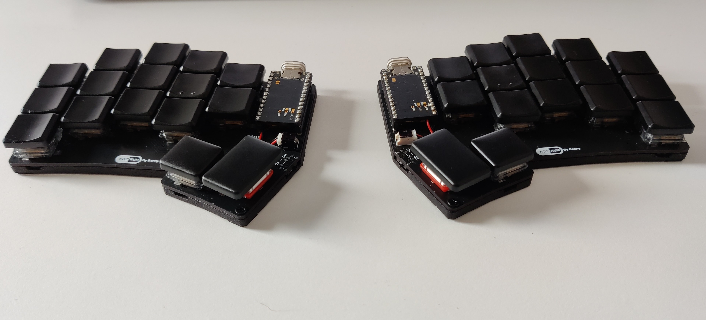
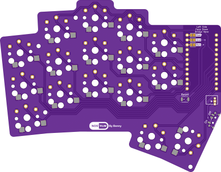
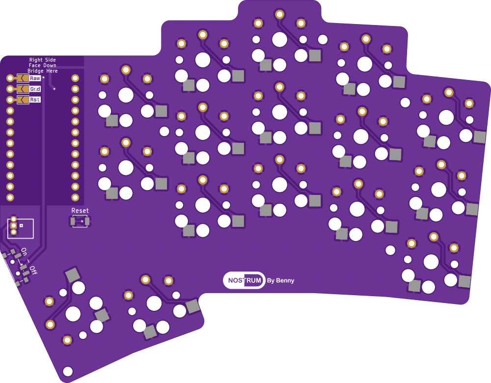
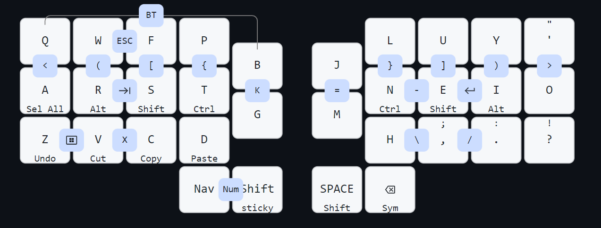

# Nostrum
A 32 key ergo split keyboard with minimal splay.
- 3° Splay on pinky and ring columns
- Inspiration from the [Hummingbird](https://github.com/PJE66/hummingbird) style [Berylline](https://github.com/jcmkk3/trochilidae#berylline) by [jcmkk3](https://github.com/jcmkk3)
- Created with the wonderful [ergogen](https://github.com/ergogen/ergogen) and KiCad7. Case files created with Autodesk Fusion360.

## PCB
| Top  | Bottom |
| ------------- | ------------- |
|   |  |

## Base Alpha Keymap
ColemakDH Based

## Notes
- The reset and power switch can be mounted on either side. I think it works better with the case/bottom plate. 
- There is a hole on the base of the case to use a paper clip to activate the manual reset if mounted on the underside.
- The "feet" on the base are made from 1mm silicone rubber sheet as I prefer this to the standard bumpons.

## Warning
The original case was experimental. As such I have removed the files for the top part of the case and updated the bottom part that works great as a minimal bottom "tray". I have updated the STLs and pcb to avoid weakness on the mounting and to fix an issue with hotswaps causing fitment issues but I have not done a test print.

