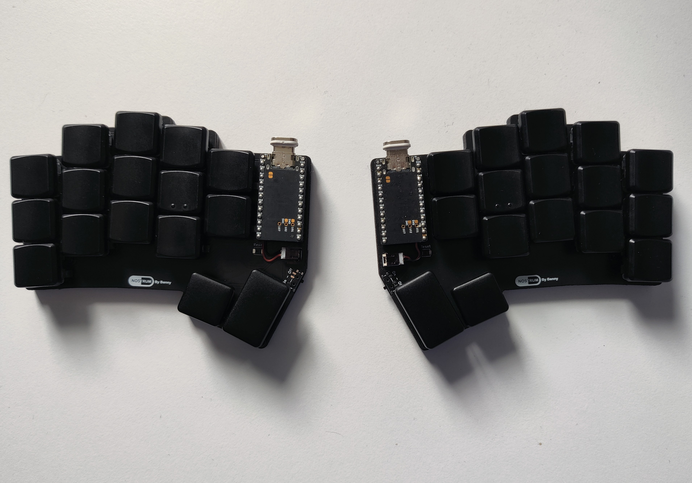

# Nostrum
A 32 key ergo split keyboard with minimal splay.
- 3° Splay on pinky and ring columns
- Inspiration from the [Hummingbird](https://github.com/PJE66/hummingbird) style [Berylline](https://github.com/jcmkk3/trochilidae#berylline) by [jcmkk3](https://github.com/jcmkk3)
- Created with the wonderful [ergogen](https://github.com/ergogen/ergogen) and KiCad7. Case files created with Autodesk Fusion360.

## PCB
| Top  | Bottom |
| ------------- | ------------- |
|   |  |

## Base Alpha Keymap
ColemakDH Based

## Notes

This is not a finished design. It is fully functional but there are some minor issues that need addressing, mainly due to compatibility with cases. I have included the STL files I used for this build but I do not recommend anyone use them in the current form because of the following:
- If using choc hotswap sockets, you need to manually add a couple of notches for it to fit.
- The mount hole under the inner (reachy) thumb needs moving in a bit. Current location makes the case too fragile for resin printed cases and it cracks when inserting the heat insert.
- The hole for the usb needs to be slightly lower and a larger. Currently you need to lift the nice!nano up a bit to align the usb with the hole and some usb cables won't fit. It is perfect for the rectangular shaped magnetic connectors shown in the pics though.

